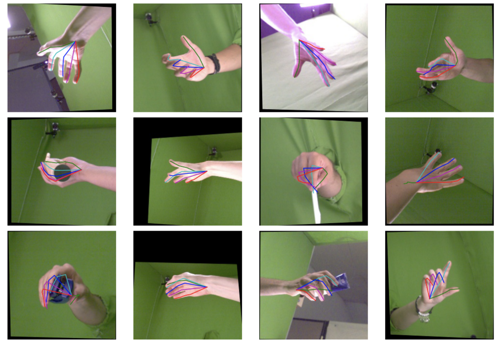
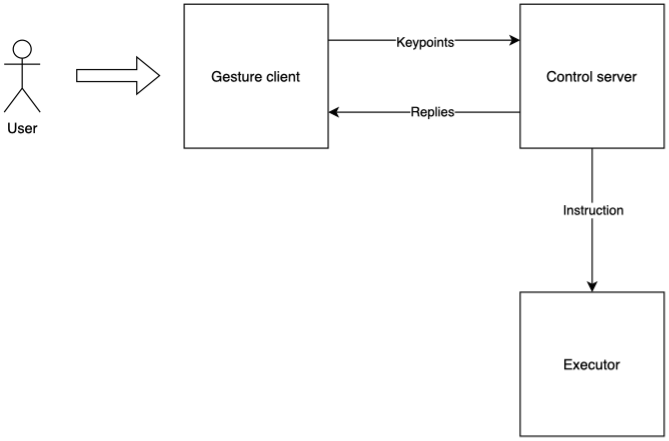
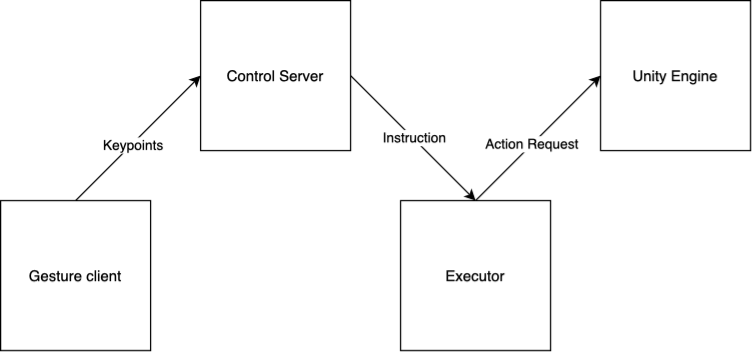
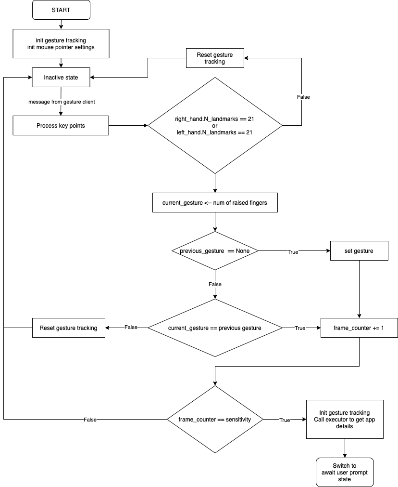
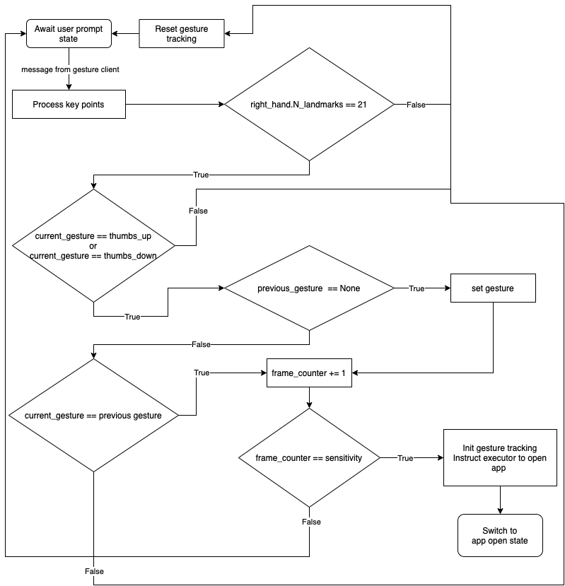
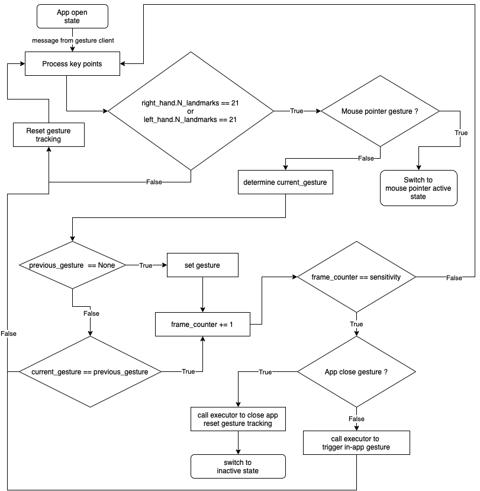

<h1 align="center"> Hand-gesture based Computer Control </h1> <br>

- [About the project](#about-the-project)
- [Objectives and scope](#objectives-and-scope)
  - [Use of Python and MacOS for development](#use-of-python-and-macos-for-development)
  - [Creation of an architecture that separates execution from pose estimation](#creation-of-an-architecture-that-separates-execution-from-pose-estimation)
  - [Investigation of 3D model control](#investigation-of-3d-model-control)
- [Solution Approach](#solution-approach)
  - [High level architecture](#high-level-architecture)
  - [Special use case - 3D model control](#special-use-case---3d-model-control)
- [Implementation](#implementation)
  - [Determine course of action - Control server](#determine-course-of-action---control-server)
    - [Inactive state](#inactive-state)
    - [Await user prompt state](#await-user-prompt-state)
    - [App open state](#app-open-state)
- [Running the simulation](#running-the-simulation)
  - [Start-up order](#start-up-order)
  - [Development environment](#development-environment)
  - [Python package versions](#python-package-versions)
- [Acknowledgments](#acknowledgments)

## About the project

In recent years, technology and computing have scaled new heights. As more and more services are now available at the click/tap of a button, we have indeed made great progress in creating accessibility to one and all. That being said, there is still a requirement for a certain level of physical interaction and understanding of the computer that helps us interface with these services. 

In a typical setting, one needs to make use of a keyboard and mouse(or track-pad in the case of a laptop) or maybe tap items on a touchscreen to convey one’s requirement and access the services and applications one requires. Despite the progress in literacy with interacting with computers in these traditional ways - there is a growing need to explore more user-friendly ways for humans to interact with computers. This effort is beneficial in terms of advancing accessibility among communities that have little prior experience with technology.

Keeping this motive in view, this project aimed to study one potential technique that can simplify the human-computer interaction - hand-pose estimation. The efforts as part of this project has resulted in a rudimentary system that can recognise hand gestures and trigger actions in the host computer. The user only needs to be aware of the supported action and what they can expect from the computer when they show the action using their hands. The attempt has been to make simple actions(like opening an app or a website, controlling the mouse pointer etc) available through hand gestures. Some general examples of hand gestures can be seen below.



## Objectives and scope

### Use of Python and MacOS for development
Python was the de-facto choice of language for implementing the modules of this project given the vast array of libraries that support use cases in pose estimation and system control. For purposes of ensuring the completion of the end-to-end workflow, the current system has been developed to be compatible for use on MacOS only. However, the effort needed to enable this system for alternate platforms would require only trivial changes.

### Creation of an architecture that separates execution from pose estimation 
Given that after a certain point in the work timeline, the bulk of enhancements would be concentrated on expanding the gesture set and on-boarding more applications - it was imperative to design an architecture that would allow separation of the various sub-problems. Specifically, the hand pose estimation has to be separated from the core decision intelligence and the logic responsible for triggering the final action.

### Investigation of 3D model control
As an extension of the existing architecture, a proof-of-concept has been implemented to investigate the viability of 3D model control using hand gestures. This work has further implications in robotics and AI.

## Solution Approach

### High level architecture



### Special use case - 3D model control

The component residing in the Unity Engine and the executor communicates via a socket-based mechanism, similar to the interaction between the gesture-client and the control server. The executor passes on ’action’ messages(stored in the private database) to the component attached to a 3D model object setup in the Unity engine. The component updates the object state based on the received message and the updated state can be seen via the Unity editor.



## Implementation

### Determine course of action - Control server

#### Inactive state


#### Await user prompt state


#### App open state


## Running the simulation

### Start-up order
1. Executor
2. Control server
3. Gesture client
4. Unity (optional)

### Development environment

```
Python                                            3.7.0
Unity                                             2021.2.19f1
```

### Python package versions
```
absl-py                                           1.0.0
attrs                                             21.4.0
certifi                                           2021.10.8
charset-normalizer                                2.0.12
click                                             8.0.4
cycler                                            0.11.0
Flask                                             2.0.3
fonttools                                         4.29.1
idna                                              3.3
importlib-metadata                                4.11.2
itsdangerous                                      2.1.0
Jinja2                                            3.0.3
keyboard                                          0.13.5
kiwisolver                                        1.3.2
MarkupSafe                                        2.1.0
matplotlib                                        3.5.1
mediapipe                                         0.8.9.1
numpy                                             1.21.5
opencv-contrib-python                             4.5.5.62
packaging                                         21.3
Pillow                                            9.0.1
pip                                               21.2.2
protobuf                                          3.19.4
PyDbLite                                          3.0.4
pyobjc                                            8.4.1
pyobjc-core                                       8.4.1
pyobjc-framework-Accessibility                    8.4.1
pyobjc-framework-Accounts                         8.4.1
pyobjc-framework-AddressBook                      8.4.1
pyobjc-framework-AdServices                       8.4.1
pyobjc-framework-AdSupport                        8.4.1
pyobjc-framework-AppleScriptKit                   8.4.1
pyobjc-framework-AppleScriptObjC                  8.4.1
pyobjc-framework-ApplicationServices              8.4.1
pyobjc-framework-AppTrackingTransparency          8.4.1
pyobjc-framework-AudioVideoBridging               8.4.1
pyobjc-framework-AuthenticationServices           8.4.1
pyobjc-framework-AutomaticAssessmentConfiguration 8.4.1
pyobjc-framework-Automator                        8.4.1
pyobjc-framework-AVFoundation                     8.4.1
pyobjc-framework-AVKit                            8.4.1
pyobjc-framework-BusinessChat                     8.4.1
pyobjc-framework-CalendarStore                    8.4.1
pyobjc-framework-CallKit                          8.4.1
pyobjc-framework-CFNetwork                        8.4.1
pyobjc-framework-ClassKit                         8.4.1
pyobjc-framework-CloudKit                         8.4.1
pyobjc-framework-Cocoa                            8.4.1
pyobjc-framework-Collaboration                    8.4.1
pyobjc-framework-ColorSync                        8.4.1
pyobjc-framework-Contacts                         8.4.1
pyobjc-framework-ContactsUI                       8.4.1
pyobjc-framework-CoreAudio                        8.4.1
pyobjc-framework-CoreAudioKit                     8.4.1
pyobjc-framework-CoreBluetooth                    8.4.1
pyobjc-framework-CoreData                         8.4.1
pyobjc-framework-CoreHaptics                      8.4.1
pyobjc-framework-CoreLocation                     8.4.1
pyobjc-framework-CoreMedia                        8.4.1
pyobjc-framework-CoreMediaIO                      8.4.1
pyobjc-framework-CoreMIDI                         8.4.1
pyobjc-framework-CoreML                           8.4.1
pyobjc-framework-CoreMotion                       8.4.1
pyobjc-framework-CoreServices                     8.4.1
pyobjc-framework-CoreSpotlight                    8.4.1
pyobjc-framework-CoreText                         8.4.1
pyobjc-framework-CoreWLAN                         8.4.1
pyobjc-framework-CryptoTokenKit                   8.4.1
pyobjc-framework-DataDetection                    8.4.1
pyobjc-framework-DeviceCheck                      8.4.1
pyobjc-framework-DictionaryServices               8.4.1
pyobjc-framework-DiscRecording                    8.4.1
pyobjc-framework-DiscRecordingUI                  8.4.1
pyobjc-framework-DiskArbitration                  8.4.1
pyobjc-framework-DVDPlayback                      8.4.1
pyobjc-framework-EventKit                         8.4.1
pyobjc-framework-ExceptionHandling                8.4.1
pyobjc-framework-ExecutionPolicy                  8.4.1
pyobjc-framework-ExternalAccessory                8.4.1
pyobjc-framework-FileProvider                     8.4.1
pyobjc-framework-FileProviderUI                   8.4.1
pyobjc-framework-FinderSync                       8.4.1
pyobjc-framework-FSEvents                         8.4.1
pyobjc-framework-GameCenter                       8.4.1
pyobjc-framework-GameController                   8.4.1
pyobjc-framework-GameKit                          8.4.1
pyobjc-framework-GameplayKit                      8.4.1
pyobjc-framework-ImageCaptureCore                 8.4.1
pyobjc-framework-IMServicePlugIn                  8.4.1
pyobjc-framework-InputMethodKit                   8.4.1
pyobjc-framework-InstallerPlugins                 8.4.1
pyobjc-framework-InstantMessage                   8.4.1
pyobjc-framework-Intents                          8.4.1
pyobjc-framework-IntentsUI                        8.4.1
pyobjc-framework-IOSurface                        8.4.1
pyobjc-framework-iTunesLibrary                    8.4.1
pyobjc-framework-KernelManagement                 8.4.1
pyobjc-framework-LatentSemanticMapping            8.4.1
pyobjc-framework-LaunchServices                   8.4.1
pyobjc-framework-libdispatch                      8.4.1
pyobjc-framework-LinkPresentation                 8.4.1
pyobjc-framework-LocalAuthentication              8.4.1
pyobjc-framework-LocalAuthenticationEmbeddedUI    8.4.1
pyobjc-framework-MailKit                          8.4.1
pyobjc-framework-MapKit                           8.4.1
pyobjc-framework-MediaAccessibility               8.4.1
pyobjc-framework-MediaLibrary                     8.4.1
pyobjc-framework-MediaPlayer                      8.4.1
pyobjc-framework-MediaToolbox                     8.4.1
pyobjc-framework-Metal                            8.4.1
pyobjc-framework-MetalKit                         8.4.1
pyobjc-framework-MetalPerformanceShaders          8.4.1
pyobjc-framework-MetalPerformanceShadersGraph     8.4.1
pyobjc-framework-MetricKit                        8.4.1
pyobjc-framework-MLCompute                        8.4.1
pyobjc-framework-ModelIO                          8.4.1
pyobjc-framework-MultipeerConnectivity            8.4.1
pyobjc-framework-NaturalLanguage                  8.4.1
pyobjc-framework-NetFS                            8.4.1
pyobjc-framework-Network                          8.4.1
pyobjc-framework-NetworkExtension                 8.4.1
pyobjc-framework-NotificationCenter               8.4.1
pyobjc-framework-OpenDirectory                    8.4.1
pyobjc-framework-OSAKit                           8.4.1
pyobjc-framework-OSLog                            8.4.1
pyobjc-framework-PassKit                          8.4.1
pyobjc-framework-PencilKit                        8.4.1
pyobjc-framework-Photos                           8.4.1
pyobjc-framework-PhotosUI                         8.4.1
pyobjc-framework-PreferencePanes                  8.4.1
pyobjc-framework-PushKit                          8.4.1
pyobjc-framework-Quartz                           8.4.1
pyobjc-framework-QuickLookThumbnailing            8.4.1
pyobjc-framework-ReplayKit                        8.4.1
pyobjc-framework-SafariServices                   8.4.1
pyobjc-framework-SceneKit                         8.4.1
pyobjc-framework-ScreenCaptureKit                 8.4.1
pyobjc-framework-ScreenSaver                      8.4.1
pyobjc-framework-ScreenTime                       8.4.1
pyobjc-framework-ScriptingBridge                  8.4.1
pyobjc-framework-SearchKit                        8.4.1
pyobjc-framework-Security                         8.4.1
pyobjc-framework-SecurityFoundation               8.4.1
pyobjc-framework-SecurityInterface                8.4.1
pyobjc-framework-ServiceManagement                8.4.1
pyobjc-framework-ShazamKit                        8.4.1
pyobjc-framework-Social                           8.4.1
pyobjc-framework-SoundAnalysis                    8.4.1
pyobjc-framework-Speech                           8.4.1
pyobjc-framework-SpriteKit                        8.4.1
pyobjc-framework-StoreKit                         8.4.1
pyobjc-framework-SyncServices                     8.4.1
pyobjc-framework-SystemConfiguration              8.4.1
pyobjc-framework-SystemExtensions                 8.4.1
pyobjc-framework-UniformTypeIdentifiers           8.4.1
pyobjc-framework-UserNotifications                8.4.1
pyobjc-framework-UserNotificationsUI              8.4.1
pyobjc-framework-VideoSubscriberAccount           8.4.1
pyobjc-framework-VideoToolbox                     8.4.1
pyobjc-framework-Virtualization                   8.4.1
pyobjc-framework-Vision                           8.4.1
pyobjc-framework-WebKit                           8.4.1
pyparsing                                         3.0.7
python-dateutil                                   2.8.2
python-dotenv                                     0.19.2
requests                                          2.27.1
setuptools                                        58.0.4
six                                               1.16.0
typing_extensions                                 4.1.1
urllib3                                           1.26.9
Werkzeug                                          2.0.3
wheel                                             0.37.1
zipp                                              3.7.0
```

## Acknowledgments
1. Google Mediapipe - https://google.github.io/mediapipe/solutions/hands.html
2. 2D Hand pose estimation - https://notrocketscience.blog/gentle-introduction-to-2d-hand-pose-estimation-approach-explained/
3. Python keyboard control - https://stackabuse.com/guide-to-pythons-keyboard-module/
4. Python mouse control - https://web.archive.org/web/20111229234504/http://www.geekorgy.com:80/index.php/2010/06/python-mouse-click-and-move-mouse-in-apple-mac-osx-snow-leopard-10-6-x/
5. Open source assets for Unity - https://assetstore.unity.com/packages/3d/animations/melee-axe-pack-35320
